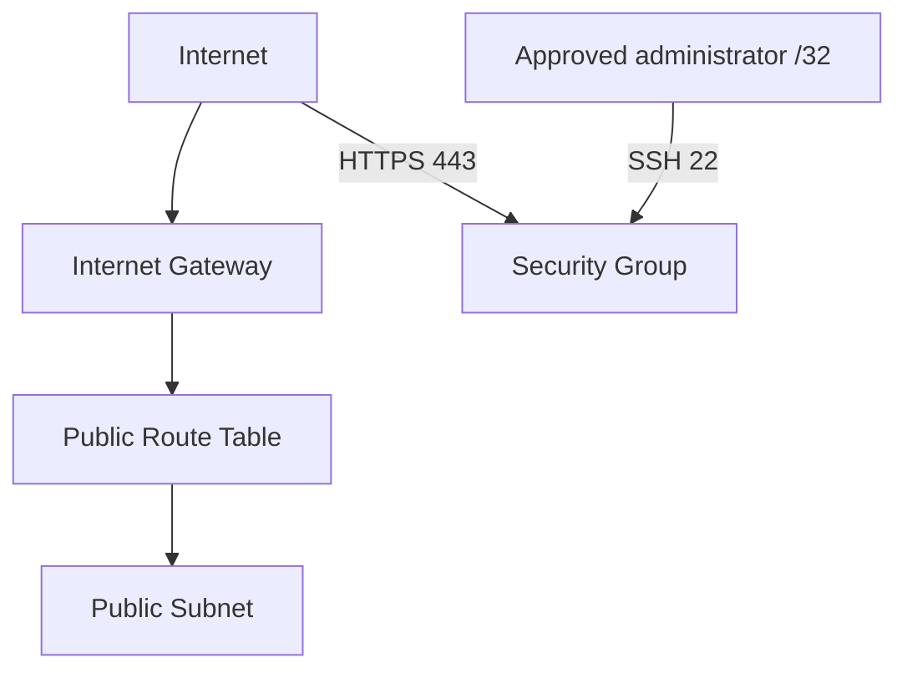

# Secure Terraform Before Deployment — AWS Proof of Concept

A security-focused Terraform proof of concept demonstrating how to review AWS infrastructure code before deployment.

## Related AWS Infrastructure Project

This security-review project complements my original AWS Terraform proof of concept:

[View AWS Proof of Concept](https://github.com/EvelioMorales/AWS-Proof-of-Concept)

The original project demonstrates Terraform-based AWS infrastructure. This repository focuses on reviewing that type of infrastructure for public exposure, sensitive files, restricted administrative access, configuration validity, and CI security controls.

This project creates the Terraform configuration for:

- An AWS VPC
- A public subnet
- An internet gateway
- A public route table
- Public HTTPS access on port 443
- Restricted SSH access on port 22
- Terraform input validation
- Automated PowerShell security checks

> This is a review-only proof of concept. No infrastructure needs to be deployed to complete the lab.

## Architecture



## Security controls

| Control | Implementation |
| --- | --- |
| Restricted administrative access | SSH uses `var.admin_cidr` |
| Input validation | Administrator CIDR must be an IPv4 `/32` |
| Secret protection | State, variable and environment files are excluded by `.gitignore` |
| Public-IP reduction | Automatic public IP assignment is disabled |
| Provider consistency | `.terraform.lock.hcl` records the selected AWS provider version |
| Automated review | PowerShell script checks secrets, tracked files, public CIDRs and SSH |

## Project structure

```text
Secure_Terraform_Before_Deployment/
├── scripts/
│   └── security-review.ps1
├── .gitignore
├── .terraform.lock.hcl
├── network.tf
├── outputs.tf
├── security.tf
├── terraform.tfvars.example
├── variables.tf
├── versions.tf
└── README.md
```

## Prerequisites

- Terraform 1.5 or newer
- AWS provider
- PowerShell
- Git
- Visual Studio Code

AWS credentials are not required for formatting and validation.

## Initialize and validate

```powershell
terraform init
terraform fmt -check
terraform validate
```

Expected result:

```text
Success! The configuration is valid.
```

## Run the security review

```powershell
powershell.exe -NoProfile -ExecutionPolicy Bypass -File ".\scripts\security-review.ps1"
```

The script checks for:

1. Possible hard-coded credentials
2. Tracked state, private variable or environment files
3. Uses of `0.0.0.0/0`
4. Public SSH exposure
5. Use of the restricted `admin_cidr` variable

## Understanding public CIDRs

Not every `0.0.0.0/0` entry has the same security meaning.

| Location | Purpose | Review decision |
| --- | --- | --- |
| Route table | Sends internet-bound traffic to the internet gateway | Expected |
| HTTPS ingress | Allows public web traffic on port 443 | Intentionally public |
| Egress rule | Allows outbound traffic | Accepted for this proof of concept |
| SSH ingress | Administrative access on port 22 | Must never be publicly accessible |

SSH uses:

```hcl
cidr_blocks = [var.admin_cidr]
```

It does not use:

```hcl
cidr_blocks = ["0.0.0.0/0"]
```

## Why validation is not enough

`terraform validate` checks whether Terraform configuration is structurally valid. It does not determine whether the infrastructure is secure.

A valid configuration can still contain:

- Public SSH or RDP exposure
- Excessive IAM permissions
- Hard-coded credentials
- Missing encryption
- Disabled logging
- Exposed secrets
- Insecure Terraform state

Security review and automated scanning must supplement Terraform validation.

## Safe variable example

`terraform.tfvars.example` contains documentation-only values:

```hcl
aws_region   = "us-east-1"
project_name = "secure-terraform-poc"
vpc_cidr     = "10.20.0.0/16"
admin_cidr   = "203.0.113.10/32"
```

The example administrator address is reserved for documentation. Do not use it for a real deployment.

## Important state warning

Marking a Terraform variable as `sensitive` hides it from normal output, but the value can still be stored in Terraform state.

Terraform state should be stored in a protected remote backend with:

- Encryption
- Access control
- State locking
- Versioning
- Audit logging

## Interview question

**How would you prevent insecure Terraform code from reaching production?**

I would store infrastructure code in version control and require pull-request reviews. The pipeline would run formatting, validation, security scanning and a Terraform plan before approval. I would check for public network exposure, excessive IAM permissions, missing encryption, disabled logging and committed secrets. Credentials would come from workload identity or a secrets manager. Terraform state would use an encrypted and access-controlled remote backend with locking and versioning. Production deployment would require approval and a narrowly scoped service identity.

## Cleanup

Do not run `terraform apply` for this review lab. Remove temporary private variable files and unset temporary environment variables when finished.
